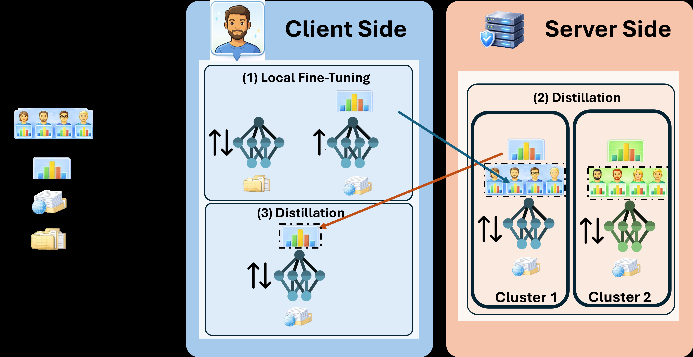
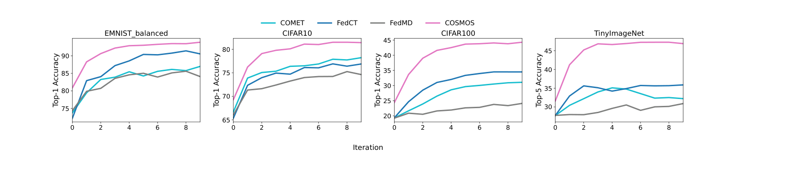
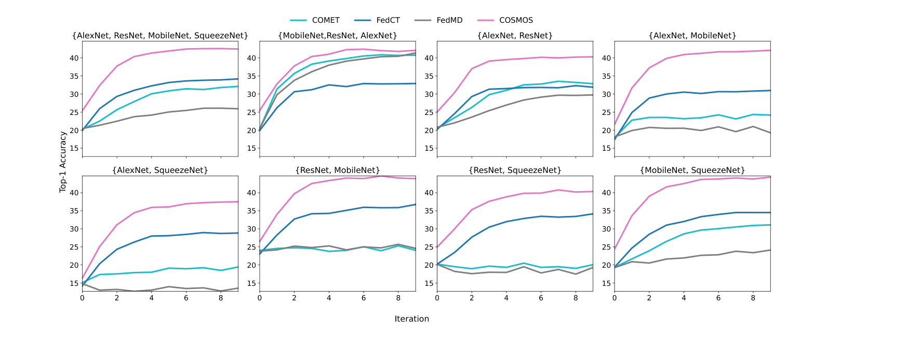

# COSMOS

**Model-agnostic personalized federated learning with clustered server models and pseudo-label-only communication.**


[](https://arxiv.org/abs/2605.11165)

This repository holds the research code for the paper [*COSMOS: Model-Agnostic Personalized Federated Learning with Clustered Server Models and Pseudo-Label-Only Communication*](https://arxiv.org/abs/2605.11165) by Ben Rachmut, Luise Ge, Ning Zhang, William Yeoh, and Yevgeniy Vorobeychik (Washington University in St. Louis).

> **Naming note:** the paper calls the method **COSMOS**. The code calls it **`MAPL`** (`AlgorithmSelected.MAPL`). They are the same algorithm.

## What COSMOS does

Federated learning gets hard when clients differ in *both* their data distributions and their model architectures. Most methods assume every client runs the same architecture, because they share model weights or gradients. That rules out clients who want to use a proprietary or best-fit architecture of their own.

COSMOS is **model-agnostic**: clients never share weights or gradients. They share only predictions (pseudo-labels) on a shared, unlabeled public dataset. This lets any client "plug in" with any architecture.

The key idea is an **active server**. Instead of acting as a passive aggregator, the server:

1. Clusters clients by the similarity of their predictions.
2. Trains a dedicated model for each cluster using its own compute.
3. Distills those cluster models back to the clients.

**Result:** COSMOS beats every model-agnostic baseline across four benchmarks, and its lead grows as the task gets harder. It also cuts communication by 1–2 orders of magnitude versus sharing parameters — for example, **3.81 MB per client vs. 114.76 MB on CIFAR-100**, and 0.38 MB vs. 113.36 MB on CIFAR-10.

## How it works



*The four steps of COSMOS: clients fine-tune locally and send pseudo-labels; the server clusters clients and distills a model per cluster; the cluster models send pseudo-labels back to their clients.*

COSMOS runs in two phases.

**Phase 1 — Pre-Training and Clustering (PTC).** Four steps:

1. **Local pre-training.** Each client trains its own model on its private data and predicts on the public set.
2. **Clustering.** The server groups clients by prediction similarity using a greedy, distance-controlled procedure. It does not need the cluster count `K` in advance — `K` emerges from a distance threshold `B0`.
3. **Server-side distillation.** The server trains one model per cluster on the cluster's averaged pseudo-labels, with a smoothness regularizer.
4. **Client-side distillation.** Each client fine-tunes on the pseudo-labels from its cluster's server model.

**Phase 2 — Iterative Federated Fine-Tuning (IFFT).** Repeat for a fixed number of rounds: local fine-tuning → server-side distillation → client-side distillation.

The paper proves that this yields **exponential contraction of the personalization risk** under stated conditions — the first general risk-contraction guarantee for model-agnostic personalized FL. See the paper for the full analysis.

## Results

COSMOS beats every model-agnostic baseline (COMET, FedCT, FedMD) across all four benchmarks, and its lead grows as the task gets harder.



*Mean client accuracy over rounds on EMNIST-balanced, CIFAR-10, CIFAR-100, and TinyImageNet. Clients use MobileNet and SqueezeNet. Top-1 accuracy, except Top-5 for TinyImageNet.*

The advantage holds across mixes of client architectures on CIFAR-100, including mixes with many weak (AlexNet) clients.



*CIFAR-100 Top-1 accuracy. Each panel is a different mix of client architectures.*

## Repository structure

| Path | Role |
|---|---|
| [main_.py](main_.py) | Entry point. Holds the experiment driver, the per-algorithm `run_*` functions, the federated-learning loops, and `RecordData` (result serialization). |
| [entities.py](entities.py) | Core library. All model definitions (`AlexNet`, `VGGServer`, `ResNet18Server`, `MobileNetV2Server`, `SqueezeNetServer`, `DenseNetServer`) and every algorithm's `Client`/`Server` classes, including the COSMOS clustering logic in `Server`. |
| [functions.py](functions.py) | Data pipeline (dataset download, non-IID/Dirichlet partitioning, client creation) and result saving. |
| [config.py](config.py) | All enums (datasets, algorithms, net types, clustering techniques) and the `ExperimentConfig` singleton that carries every hyperparameter. |
| [read_json.py](read_json.py) | Standalone analysis tool. Reads the JSON results and produces the paper's figures (PDF) and stats (CSV). |
| [requirements.txt](requirements.txt) | Dependencies for GPU (CUDA 12.1). |
| [new_require.txt](new_require.txt) | Alternate dependencies for CPU. |

## Installation

```bash
git clone <this-repo-url>
cd cluster_fed_learning
python -m venv .venv
# Windows:  .venv\Scripts\activate
# Linux/Mac: source .venv/bin/activate
```

Then install dependencies. Pick the file that matches your hardware:

```bash
# GPU (CUDA 12.1)
pip install -r requirements.txt

# CPU only
pip install -r new_require.txt
```

> `requirements.txt` is saved as UTF-16. If `pip` fails to read it, re-save it as UTF-8 first.

Datasets download automatically to `./data` on first run.

## Running experiments

**There is no command-line interface yet. You configure runs by editing the code.**

Open the `if __name__ == '__main__':` block at the bottom of [main_.py](main_.py) and set the sweep lists:

| Variable | Controls |
|---|---|
| `data_sets_list` | Which datasets to run (e.g. `[DataSet.CIFAR100]`). |
| `num_clients_list` | Number of clients (paper uses 25). |
| `num_opt_clusters_list` | Number of ground-truth client groups. |
| `alpha_dichts` | Dirichlet concentration for non-IID splitting (paper uses 5). |
| `algorithm_selection_list` | Which methods to run, e.g. `[AlgorithmSelected.MAPL]` for COSMOS. |
| `nets_types_list_PseudoLabelsClusters` | Client/server architecture pairing. |
| `cluster_technique_list` | Clustering method (COSMOS default: `greedy_elimination_L2`). |

Then run:

```bash
python main_.py
```

Each run writes one JSON file per seed into `results/<descriptive-folder-name>/`. The folder name encodes the dataset, algorithm, architectures, client count, ratios, alpha, and cluster count.

## Reproducing the paper figures

After you have results in `results/`, generate the figures and stats:

```bash
python read_json.py
```

This reads the `results/` subfolders, computes per-method accuracy statistics (with paired t-tests against the best method), and writes PDF figures and CSV tables to `figures/`. The script expects result subfolders named after each experiment (for example `diff_benchmarks_05`, `diff_clients_nets`, `client_scale`, `mapl_lambda`, `clusters`).

## What's supported

**Datasets** (`config.py: DataSet`):

| Dataset | Classes |
|---|---|
| CIFAR-10 | 10 |
| CIFAR-100 | 100 |
| TinyImageNet | 200 |
| EMNIST-balanced | 47 |
| SVHN | 10 |
| ImageNet-R | 200 |
| ImageNet-100 | 100 |

**Algorithms** (`config.py: AlgorithmSelected`):

| Method | In code | Type |
|---|---|---|
| **COSMOS** | `MAPL` | This paper |
| FedMD | `FedMD` | Model-agnostic baseline |
| COMET | `COMET` | Model-agnostic baseline |
| FedCT | `FedCT` | Model-agnostic baseline |
| FedAvg | `FedAvg` | Classic FL |
| Ditto | `Ditto` | Personalized FL |
| FedBABU | `FedBABU` | Personalized FL |
| pFedMe | `pFedMe` | Personalized FL |
| pFedCK | `pFedCK` | Clustered PFL |
| pFedHN | `pFedHN` | Hypernetwork PFL |
| FedSelect | `FedSelect` | Personalized FL |
| Centralized | `Centralized` | Reference |
| No federated learning | `NoFederatedLearning` | Reference (local only) |

**Architectures** (`config.py: NetType`): AlexNet, ResNet18, MobileNetV2, SqueezeNet (clients); VGG16, AlexNet, DenseNet (server). Client and server architectures are paired through the `NetsType` enum.

## Experiment setup (from the paper)

- **Data split:** Dirichlet non-IID. The label space is split into 5 disjoint groups (20% of classes each), and clients are assigned to a group.
- **Cross-group mixing:** 10% of each client's samples are pooled, shuffled, and redistributed to reflect realistic data sharing.
- **Public pool `U`:** 20% of all training data.
- **Main runs:** 25 clients, 10 communication rounds, 3 random seeds.
- **Default heterogeneity:** Dirichlet `α = 5` (paper also reports `α ∈ {1, 100}`).
- **Client architectures:** AlexNet, ResNet18, MobileNet, SqueezeNet. **Server:** VGG16.
- **Best hyperparameters:** distillation temperature `T = 1`, regularization weight `λ = 5`.

## Citation

If you use this work, please cite the paper ([arXiv:2605.11165](https://arxiv.org/abs/2605.11165)):

```bibtex
@article{rachmut2026cosmos,
  title   = {COSMOS: Model-Agnostic Personalized Federated Learning with
             Clustered Server Models and Pseudo-Label-Only Communication},
  author  = {Rachmut, Ben and Ge, Luise and Zhang, Ning and
             Yeoh, William and Vorobeychik, Yevgeniy},
  journal = {arXiv preprint arXiv:2605.11165},
  year    = {2026}
}
```


## Acknowledgements

Supported in part by the National Science Foundation (IIS-2214141, CCF-2403758), the Army Research Office (W911NF-25-1-0059), and the Office of Naval Research (N00014-24-1-2663).

